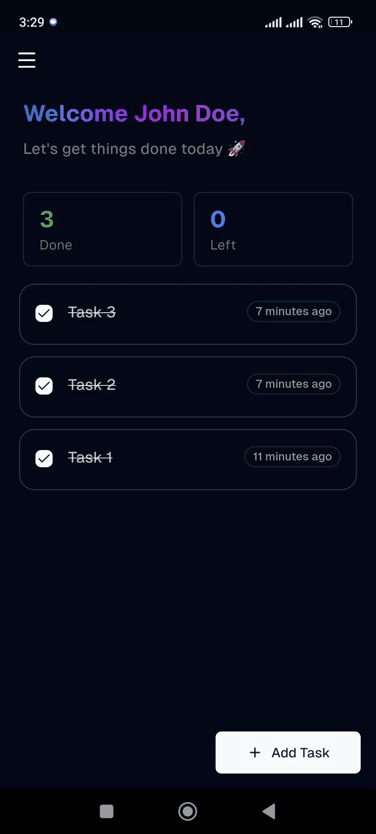
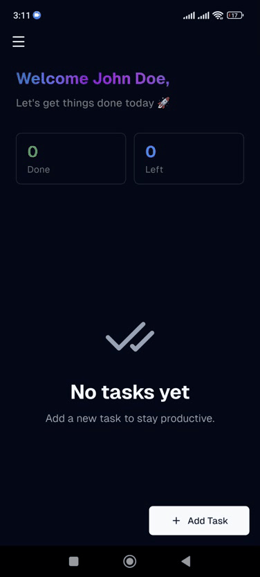
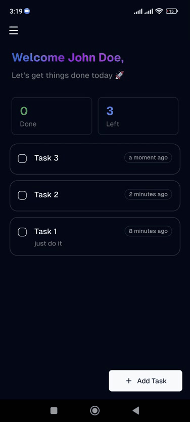
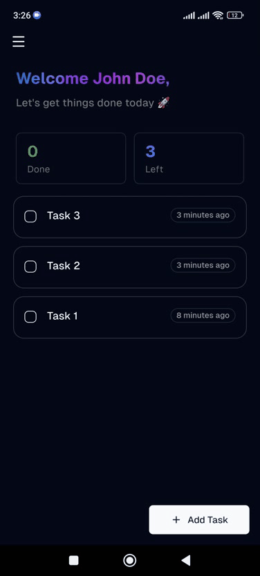

<p align="center">
  
  
</p>

<h3 align="center">A minimal task management app built with Flutter & Supabase</h3>

<p align="center">
  
  
  
  
</p>

---

## Preview

<table align="center">
  <tr>
    <td align="center">
      <br>
      <strong>Login</strong>
    </td>
    <td align="center">
      <br>
      <strong>Light Theme & Logout</strong>
    </td>
    <td align="center">
      <br>
      <strong>Add / Update</strong>
    </td>
  </tr>
</table>

<br>

<table align="center">
  <tr>
    <td align="center">
      <br>
      <strong>Optimistic Command<br>Check & Delete</strong>
    </td>
    <td align="center">
      <br>
      <strong>Failed Optimistic Update<br>Rollback</strong>
    </td>
  </tr>
</table>

## Features

- **Auth** — Email/password sign-up & login, Google OAuth (web + mobile)
- **Task CRUD** — Create, read, update, and delete tasks
- **Optimistic Updates** — Toggle done / delete update UI instantly, rolling back on server error
- **Pull-to-Refresh** — Swipe down to re-fetch tasks
- **Swipe-to-Delete** — `Dismissible` gesture with red background + trash icon
- **Skeleton Loading** — `Skeletonizer` shimmer placeholders during data fetch
- **Error Toasts** — Non-blocking `ShadToast.destructive` for failed operations
- **Theme Switching** — Light/dark mode persisted via `native_storage`
- **Auth-Aware Routing** — GoRouter redirects unauthenticated users to login

---

## Architecture

The app follows **MVVM architecture** with a **Command/Query** separation in the repository layer.

### Layer Responsibilities

| Layer      | Responsibility                                                              |
| ---------- | --------------------------------------------------------------------------- |
| **UI**     | Screens, widgets, viewmodels.                                               |
| **Domain** | Models (`Task`, `AppUser`), repositories, commands (write), queries (read). |
| **Data**   | API services (Supabase calls), local storage, DTOs. Pure data access.       |

### Command / Query Pattern

Every state mutation is encapsulated in a **Command** — a Riverpod `AsyncNotifier` that manages its own `AsyncValue<void>` lifecycle.

```
UI calls Command.run(args)
         │
         ▼
   state = AsyncValue.loading()
         │
         ▼
   state = await AsyncValue.guard(
     () => Repository.doSomething()
   );
         │
         ▼
   link.close()                      ← provider disposed after execution
```

**Why this pattern?**

- Each command is self-contained.
- `AsyncValue.guard` wraps errors automatically — UI listens via `ref.listen` and shows toasts.
- `ref.keepAlive()` + `link.close()` ensures the provider lives only for the duration of the operation.
- Commands that mutate lists (delete, toggle done) perform **optimistic updates** inside the repository, rolling back on failure.

### Available Commands

| Command                    | Args                     | Side Effect                                               |
| -------------------------- | ------------------------ | --------------------------------------------------------- |
| `AddTaskCommand`           | `title, description`     | Creates task, prepends to list                            |
| `UpdateTaskCommand`        | `id, title, description` | Updates task, syncs list                                  |
| `DeleteTaskCommand`        | `taskId`                 | Removes task optimistically, rolls back on error          |
| `SwitchDoneForTaskCommand` | `taskId, isDone`         | Toggles `isCompleted` optimistically, rolls back on error |
| `LoginCommand`             | `email, password`        | Signs in via Supabase Auth                                |
| `SignupCommand`            | `email, password, name`  | Creates account                                           |
| `GoogleSigninCommand`      | —                        | Google OAuth flow                                         |
| `LogoutCommand`            | —                        | Signs out, clears session                                 |
| `ToggleThemeModeCommand`   | `ThemeMode`              | Persists and applies theme                                |

### Queries

| Query            | Returns                | Description                                                                                          |
| ---------------- | ---------------------- | ---------------------------------------------------------------------------------------------------- |
| `ListTasksQuery` | `FutureOr<List<Task>>` | Fetches all tasks ordered by `created_at` desc. Supports inline `setState` for optimistic mutations. |

---

## Folder Structure

```
lib/
├── core/                          # Cross-cutting concerns
│   ├── exception/                 # ExceptionHandler + AppException
│   ├── logger/                    # RiverpodLogger (debug logging)
│   ├── router/                    # GoRouter config + auth redirect
│   ├── utils/
│   │   └── extensions/            # AsyncValue.showToastOnError
│   └── widgets/                   # Shared: buttons, drawer, loading, text fields
│
├── data/                          # Data access
│   ├── api/
│   │   ├── auth/                  # AuthApiService (Supabase Auth)
│   │   ├── task/                  # TaskApiService (Supabase PostgREST)
│   │   ├── dto/                   # Data transfer objects (empty)
│   │   └── supabase_client.dart   # Singleton SupabaseClient
│   └── local/
│       ├── storage.dart           # NativeStorage singleton
│       └── theme/                 # ThemeLocalService (persisted theme)
│
├── domain/                        # Business logic
│   ├── mapper/                    # UserMapper (User → AppUser)
│   ├── models/                    # Task, AppUser
│   └── repository/
│       ├── task/
│       │   ├── command/           # Add, Delete, Update, SwitchDone
│       │   ├── query/             # ListTasksQuery
│       │   └── task_repository.dart
│       ├── user/
│       │   ├── command/           # Login, Signup, Logout, GoogleSignin
│       │   ├── notifiers/         # UserNotifier
│       │   └── user_repository.dart
│       └── theme/
│           ├── command/           # ToggleThemeModeCommand
│           ├── notifiers/         # ThemeModeNotifier
│           └── theme_repository.dart
│
├── ui/                            # Screens
│   ├── home/                      # Home page + viewmodel + widgets
│   ├── add_task/                  # Add/Edit task form
│   ├── login/                     # Login page + viewmodel
│   ├── signup/                    # Signup page
│   ├── splash/                    # Splash/loading screen
│   └── 404/                       # Error page
│
├── app.dart                       # ShadApp.router setup
└── main.dart                      # Entry point (Supabase init, dotenv)
```

---

## Supabase Setup

### 1. Create a Supabase Project

Go to [supabase.com](https://supabase.com) and create a new project. Note your **Project URL** and **Anon Key** from Settings > API.

### 2. Create the `task` Table

Run this SQL in the **SQL Editor** (Supabase Dashboard > SQL Editor):

```sql
create table task (
  id         uuid primary key default gen_random_uuid(),
  user_id    uuid references auth.users(id) on delete cascade,
  title      text,
  description text,
  is_completed boolean not null default false,
  due_date   timestamptz,
  created_at timestamptz not null default now(),
  updated_at timestamptz not null default now()
);

-- Index for fast lookup by user
create index idx_task_user_id on task(user_id);

-- Auto-update updated_at on row update
create or replace function update_updated_at()
returns trigger as $$
begin
  new.updated_at = now();
  return new;
end;
$$ language plpgsql;

create trigger task_updated_at
  before update on task
  for each row
  execute function update_updated_at();
```

### 3. Enable Row Level Security (RLS)

```sql
alter table task enable row level security;

-- Users can only read their own tasks
create policy "Users read own tasks"
  on task for select
  using (auth.uid() = user_id);

-- Users can insert tasks for themselves
create policy "Users insert own tasks"
  on task for insert
  with check (auth.uid() = user_id);

-- Users can update their own tasks
create policy "Users update own tasks"
  on task for update
  using (auth.uid() = user_id);

-- Users can delete their own tasks
create policy "Users delete own tasks"
  on task for delete
  using (auth.uid() = user_id);
```

### 4. Enable Auth Providers & Google OAuth Setup

---

## Getting Started

### 1. Clone & Install

```bash
git clone https://github.com/Hiwa-Shaloudegi/supa-task.git
cd supa-task
flutter pub get
```

### 2. Configure Environment

```bash
cp .env.example .env
```

Edit `.env` with your Supabase credentials:

```env
SUPABASE_URL=https://your-project.supabase.co
SUPABASE_ANON_KEY=your-anon-key-here
GOOGLE_WEB_CLIENT_ID=your-google-web-client-id
GOOGLE_IOS_CLIENT_ID=your-google-ios-client-id
```

### 3. Run Code Generation

```bash
dart run build_runner build --delete-conflicting-outputs
```

### 4. Run the App

```bash
flutter run
```
